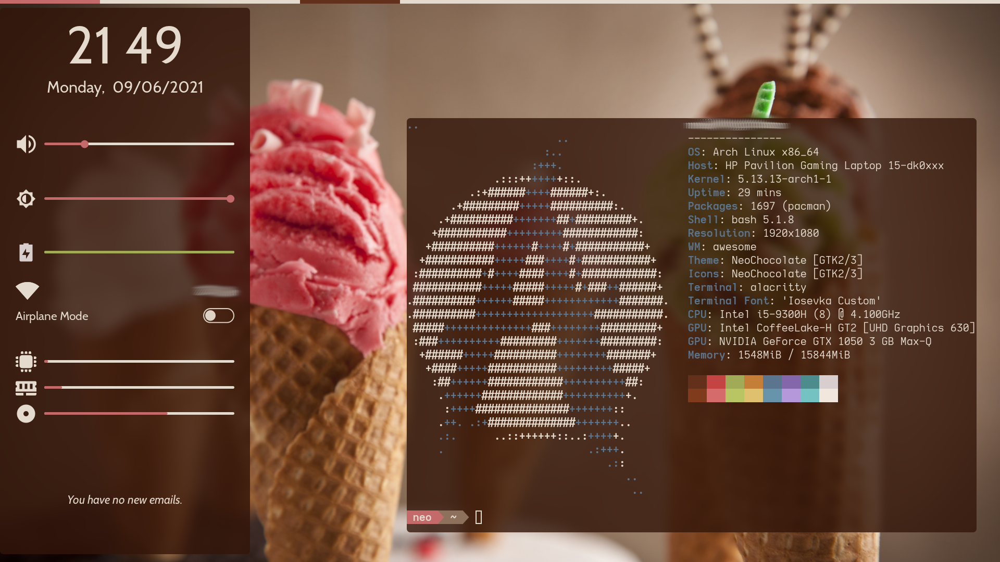
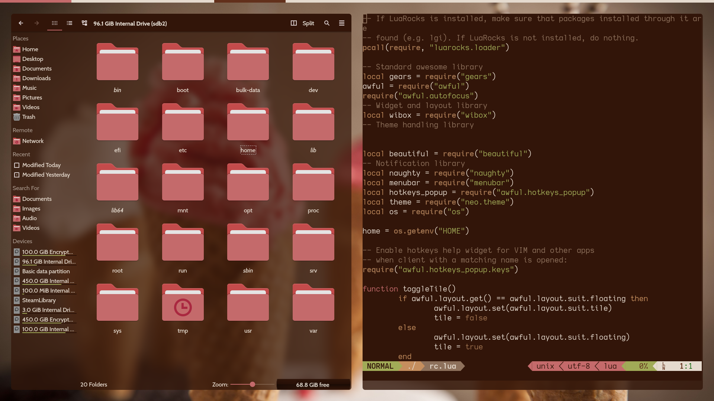
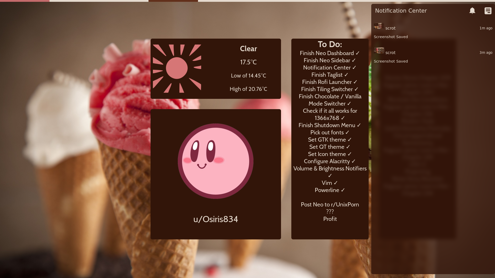
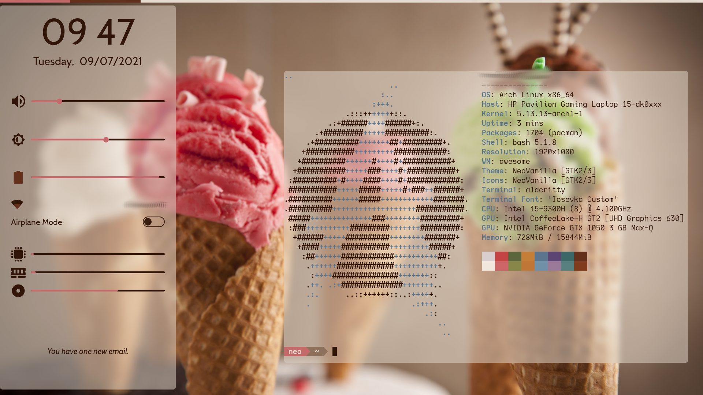
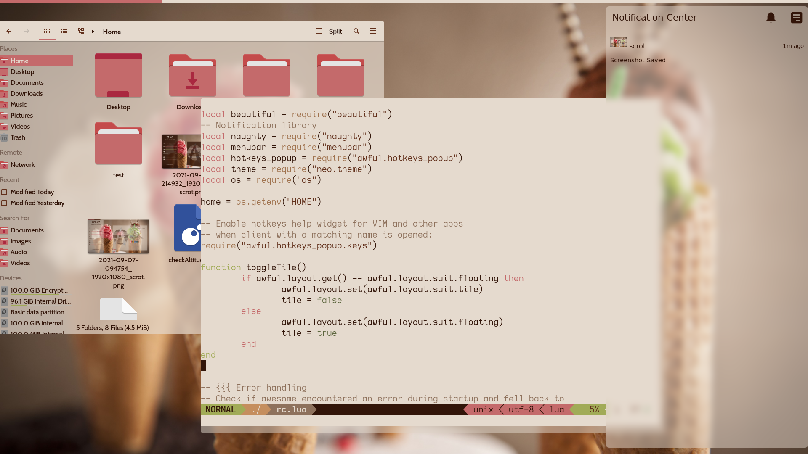

# Neo Dotfiles

## Pictures
Neo Autoswitches between Chocolate Mode in the Night, and Vanilla Mode in the day. These screenshots showcase these modes, as well as the Kvantum theme I made, and the widgets. There are rofi menus but I can't activate screenshot when they're loaded, but they look really nice.

## Introduction
Neo is not a matrix reference. Neo is short for Neapolitan Ice Cream which is Vanilla, Chocolate or Coffee Ice Cream, and then Strawberry or Cherry ice cream in this order.

Vanilla|Chocolate|Strawberry

Anyways I added mint green to it because it was a good accent color.

## Software Used
* Awesomewm for Window Manager
* Rofi for App launcher and Tiling mode manager. Invoke with Meta+D, Tiling mode is Meta+Shift+Space
* Terminal: Alacritty
* Powerline for shell prompt
* Lock Screen: i3lock
* GTK Theme: NeoChocolate + NeoVanilla
* Kvantum: NeoChocolate + NeoVanilla
* Icon Theme: Oomox Papirus Neo(Chocolate + Vanilla)
* Font: Cabin

## Chocolate Mode and Vanilla Mode
Neo dynamically switches between Chocolate Mode and Vanilla Mode to reduce eye stress late at night. This is controlled by `.config/awesome/widgets/themeSwitcher.lua` to calculate sun position which later calls `.config/awesome/scripts/set_theme.sh` to handle switching vim themes, powerline, alacritty, and rofi. I haven't added an easy way to disable it, but you should *probably* be able to remove all calls to it with minimal issues. You should enter your location in the file so it gets the solar geometry right.

## Installation
There's a 0% chance this will work completely for your computer, I haven't tested it for 4k screens because I don't have one or bother to simulate one. Things you will want to personalize, here's a list of locations and how to change each one. Note that line numbers may be inaccurate due to my laziness.

* install everything in `DEPENDS`
* `.config/awesome/rc.lua` line 107, add your location because geoclue is not working for me as far as I can tell, if it works for you update the redshift command, or remove it if you do not want redshift during the night.
* `.config/awesome/neo/theme.lua` add your monitor refresh rate for smoother slidebar animation calculations, it's already set to 60. 
* `.config/awesome/weather.py` be sure to enter your OWM weather api key for weather services to work, as well as your zip code and country, and preferred units.
* `.config/awesome/getGmail.py` This is a script to get the number of emails in your Gmail inbox. if you do not use Gmail, then this will not work and you will need to write your own script. Grab your [credentials.json](https://cloud.google.com/docs/authentication/getting-started) and pop it into the same directory, and run the script once in your terminal to create the proper authentication pickle files.
* `.config/awesome/scripts/getTodo.sh` this essentially prints out the file at `~/.todo`. feel free to make your own script here if you want. I didn't want to waste much time on my own, so my todo program is vim.
* `.config/awesome/scripts/clirus.py` Clirus is a pretty simple RSS reader I cobbled together in two days and is just generally not flattering code. (Just like these dotfiles) Anyways, just add RSS feed urls to the list on line 10. If you can't think of any of them, XKCD has one, Reddit has one somewhat, but Clirus would likely get stuck on pinned posts, although I have not tested this.
* `.config/powerline` powerline requires a lot of tinkering to get installed properly, but the colorscheme I made does look great. Note that I enabled truecolor on powerline, and if you try to use it on non-truecolor terminal emulators, it will default to 8 bit colors, which have a terrible selection of browns, and will not look good.
* `.vimrc` contains only the minimum to get the colors working, you can figure out how to merge it properly with yours.
* `.config/awesome/neo/background.png` this is the background image if you want to change it. If you find a cool image of ice cream that fits the colorscheme than mine, let me know.
* `.config/awesome/icons/profile_pic.png` I like Kirby a lot, but thats where you would put the pfp you want.
* `.config/awesome/scripts/getBatt.sh` edit the path to your battery, mine's BAT1, but your's might not be.
* I haven't included the GTK, QT, and Icons theme, because you can install that yourself. Icons theme is Luna.
* `.config/rofi/menus/shared/settings.rasi` Change the resolution here if you have a 1336x768 screen. If you have a screen of a different size, you *should* be able to use ratios to scale the margins and paddings upwards. Credit to [vahnrr](https://gitlab.com/vahnrr/rofi-menus) for making the rofi config this is adapted from.
* be sure to copy the shutdown menu script + lid lock script from `.config/awesome/scripts/acpi/` to `/etc/acpi/` and add acpi events to use them.
* Install the fonts needed. There are some in `.config/awesome/icons`
* Set the kvantum theme at point qt5ct towards the icon theme, and kvantum, as well as set the gtk theme with lxappearance
* Big Shoutout to [manilarome](https://github.com/manilarome/the-glorious-dotfiles/tree/master/config/awesome/floppy/widget/notif-center) whose awesome notification center widget I've stolen and modified slightly for Neo.
There is probably something that I have forgotten to update here. I hope this is enough help if you want to use some of my configs/scripts. Be warned there is basically no error catching on any of my scripts due to laziness.
